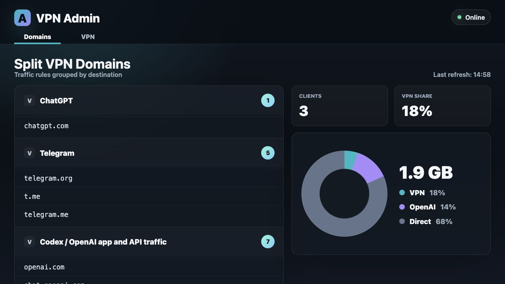
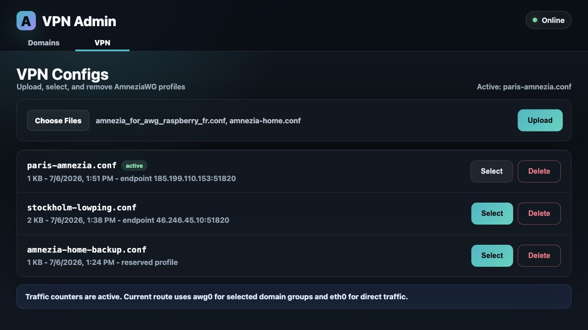

# Amnezia Raspberry

Self-contained Raspberry Pi split-VPN router setup for AmneziaWG, with a small
local admin UI.

The app is intentionally lightweight:

- Python standard library only
- systemd service
- no build step
- reads split-VPN domains from `/etc/vpn-split-domains.txt`
- shows connected Wi-Fi clients from `iw dev wlan0 station dump`
- manages AmneziaWG profiles through a narrow root helper

## Screenshots





## Features

- `GET /admin` - web UI
- `GET /admin/api/domains` - grouped domain list
- `GET /admin/api/status` - connected client count
- VPN config upload, select, and delete
- VPN vs Direct traffic chart, when nftables counters are installed

## Deploy

From this project directory:

```sh
./scripts/deploy.sh --host pi@10.42.0.1 --key /path/to/codex_pi_key
```

After deploy, open:

```text
http://10.42.0.1/admin
```

## Prepare a Fresh SD Card

You can prepare a freshly flashed Raspberry Pi OS card from your laptop without
mounting the Linux root partition. The script writes only to the FAT boot
partition and installs a first-boot provisioner.

1. Flash Raspberry Pi OS Lite 64-bit with Raspberry Pi Imager.
2. Remove and insert the card again so the boot partition is mounted.
3. Run:

```sh
./scripts/prepare-sd-card.sh \
  --boot /Volumes/bootfs \
  --ssh-key ~/.ssh/id_ed25519.pub \
  --ap-ssid Amnezia-Pi \
  --ap-password 'change-me-please'
```

On first Raspberry Pi boot, connect Ethernet with internet access. The boot flow
is intentionally staged:

- boot 1 registers a normal systemd provision service and reboots
- boot 2 installs packages, router config, admin UI, nftables, timers, AP config,
  SSH key, then reboots
- boot 3 should expose the AP and admin UI

After provisioning, connect to the AP and open:

```text
http://10.42.0.1/admin
```

The provisioner creates/configures the `pi` user by default. Use
`--login-user`, `--password-hash`, and `--ssh-key` to customize access.

AmneziaWG availability depends on the base OS repositories. If `awg-quick` is
not available from apt, pass `--amneziawg-install-url URL` for your preferred
installer, or install AmneziaWG after first boot. The admin UI can still upload
profiles, but selecting one requires `awg-quick`.

## Configuration

The systemd unit uses these defaults:

```text
DOMAINS_FILE=/etc/vpn-split-domains.txt
VPN_ADMIN_WIFI_IFACE=wlan0
VPN_ADMIN_BIND=0.0.0.0
VPN_ADMIN_PORT=80
VPN_ADMIN_HELPER=/usr/local/sbin/vpn-admin-helper
```

AmneziaWG profile management expects:

```text
active config: /etc/amnezia/amneziawg/awg0.conf
profile store: /etc/amnezia/amneziawg/profiles/
service:       awg-quick@awg0.service
```

Traffic accounting expects nftables rules with counters for both directions:

```text
wlan0 -> awg0 and awg0 -> wlan0: VPN traffic
wlan0 -> eth0 and eth0 -> wlan0: Direct traffic
```

The reference rules live in:

```text
nftables/vpn-router.nft
```

## Security Note

The UI currently has no authentication. Only expose it on a trusted local network.

The deploy script installs a sudoers rule that allows the web-service user to
run `/usr/local/sbin/vpn-admin-helper` as root. The helper validates profile
names and config shape, but this is still a privileged local admin surface.
